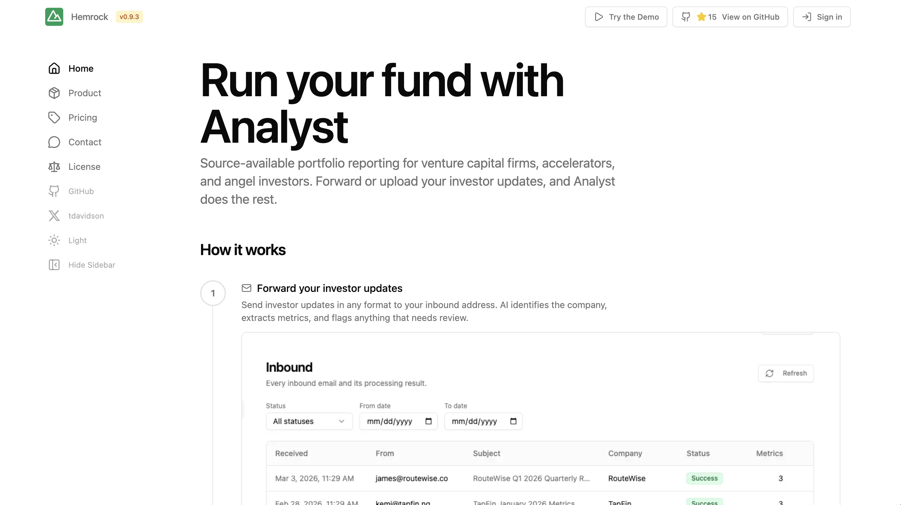

 

# LP Portfolio Reporting Done

From founder emails to LP reports automatically. Every quarter you spend 20 hours building LP reports by copying metrics from PowerPoint slides and Excel files that founders send you. Your LPs expect institutional-grade reporting but you're doing data entry by hand. I built a system that processes investor updates automatically — forward emails in any format, AI extracts the metrics, and you get real-time portfolio dashboards plus formatted reports ready for your next LP meeting.

## What it does

Forward investor updates in any format — PDF, Excel, PowerPoint, plain text — and AI identifies the company, extracts metrics, and builds portfolio dashboards. Track and report investment performance metrics at company, fund, and portfolio levels. Generate institutional-grade LP reports without manual data entry.

## How it works

• **Email forwarding** — Give founders an inbound address, system processes everything automatically
• **AI extraction** — Identifies companies and pulls metrics like MRR, burn rate, headcount, and any custom KPIs you set from any format
• **Portfolio dashboard** — Real-time view of company health with key metrics and trend analysis
• **Review queue** — Flags uncertain extractions for human verification before saving
• **LP reporting** — Export clean data or use built-in templates for professional presentation
• **Lightweight CRM** - Track intros, strategy, qualitative value-adds to demonstrate how you work with your portfolio

> Detailed feature descriptions at [FEATURES](./FEATURES.md)

## Why should you use this

- **Data consistency and availability** - One source of truth for your team. Reduce your reliance on a maze of spreadsheets. Everyone works from the same portfolio data, metrics, and reports from a central location.
- **Built to work with AI** - Bring your fund data to your own AI, and use it to ask anything about your portfolio and fund. Ask about benchmarks, trends, industry data, research, and more.
- **Professionalize internal operations** - Institutional-quality reporting infrastructure without the cost of enterprise software. Run it yourself, on your own terms.
- **Built for how funds work** - Designed by a fund CFO for key workflows, including investor updates, LP reporting, and portfolio monitoring. Works alongside your fund admin and operations team.

## Why this exists

Built by Taylor Davidson of [Hemrock](https://www.hemrock.com). I've worked with thousands of general partners and founders as a CFO, venture capitalist, and consultant.

I've worked as an investor, CFO, and consultant for funds for over a decade and have experienced first hand the problems with manually collecting, analyzing, and presenting quantitative and qualitative data about the performance and forecasts for funds and their portfolio investments.

Fund managers shouldn't have to choose between good tooling and owning their data. Most portfolio reporting platforms lock your data in their database, process it through their AI, and charge per seat so half your team can't log in.

This is a complete portfolio reporting platform you deploy on your own infrastructure — your database, your AI keys, your domain. No per-seat fees. No black-box AI training on your portfolio. No vendor lock-in. The source code is yours to inspect, modify, and run forever.

Built by a fund manager, for fund managers.

## Get started

Self-hosted version is free for single fund management companies. [Try the demo](https://portfolio.hemrock.com/demo) with sample data, no signup required. You can modify it and deploy it on your own infrastructure and on your own domain.

Managed deployments are available, [contact Taylor](https://portfolio.hemrock.com/contact) if you want him to deploy this for you on your infrastructure.

If you are a fund administrator, outsourced CFO, consultant, or service provider using this across multiple clients, you need a paid commercial license. You cannot resell it, white-label it, offer it as SaaS, or bundle it into another product.

See [LICENSE](./LICENSE.md) for full terms. For commercial licensing, [contact Taylor](https://portfolio.hemrock.com/contact).

## Quick start

Technical deployment details at [DOCS](./DOCS.md)

For setup assistance, hosted deployments, or questions: [hemrock.com/contact](https://www.hemrock.com/contact).

For bug reports and feature requests: [GitHub Issues](https://github.com/tdavidson/reporting/issues).